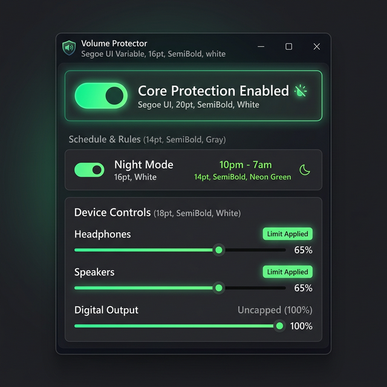

<div align="center">

# 🛡️ Volume Protector
### *Prevent hearing damage by enforcing hard volume limits.*

[](https://github.com/Santaslileper/Ear-protection)
[](https://github.com/Santaslileper/Ear-protection)
[](https://github.com/Santaslileper/Ear-protection)
[](docs/LICENSE)
[](https://github.com/Santaslileper/Ear-protection)
[](https://github.com/Santaslileper/Ear-protection)

**Volume Protector** is a ultra-lightweight Windows utility that monitors your audio devices in real-time. It ensures your volume never exceeds a safe threshold, even if a game, driver update, or accidental keypress tries to spike it.

[**Download Latest Release**](https://github.com/Santaslileper/Ear-protection/releases/latest) • [**Source Code**](src/VolumeProtector.cs) • [**Report a Bug**](../../issues)

---



</div>

## 💡 Why You Need This
Noise-induced hearing loss (NIHL) is a global health crisis that is permanent and cumulative. Modern Windows systems have no native "hard cap" for volume; any application can request 100% output without warning.

**Volume Protector** is an extensive research project aimed at providing the **lightest possible footprint** while delivering professional-grade auditory safety. It acts as a system-level safety fuse, intercepting volume changes before they reach your ears.

### ✨ Key Features
- **� Ultra-Lightweight:** A single ~28 KB executable. No installation, no background services, no telemetry.
- **�🛡️ Active Device Monitoring:** Uses a 100ms polling loop for high-precision volume clamping.
- **🎨 Dark Settings UI:** A custom-drawn, borderless charcoal interface for professional management.
- **🖥️ Per-Device Control:** Independent limits for headphones, speakers, and digital outputs.
- **🔄 Mute Synchronization:** Bidirectional sync with system hardware mute status.

---

## ⚡ Quick Start (PowerShell)

You can download and launch the application directly from your terminal:

```powershell
[Net.ServicePointManager]::SecurityProtocol = [Net.SecurityProtocolType]::Tls12; $d = [Environment]::GetFolderPath("Desktop"); irm https://github.com/Santaslileper/Ear-protection/releases/latest/download/VolumeProtector.exe -OutFile "$d\VolumeProtector.exe"; Start-Process "$d\VolumeProtector.exe"
```

> [!NOTE]
> **What does this do?** It downloads one small file (`VolumeProtector.exe`, ~28 KB) straight to your **Desktop** and opens it. No installer, no setup wizard, nothing hidden. Just one file — delete it any time to uninstall.

> [!TIP]
> After launching, look for the **green shield icon** in your **system tray** (bottom-right corner of the screen, near the clock). Right-click it → **"Open Settings"** to set your volume limit per device.

---

## 🔬 Global Hearing Safety Standards
We follow the strict recommendations provided by major health organizations worldwide:

| Organization | Region | Safe Limit (8h) | Recommendation |
| :--- | :--- | :--- | :--- |
| **WHO** | Global | **80 dB** | Recreational Audio Standard |
| **EU-OSHA** | Europe | **80 dB** | Action Level 1 |
| **NIOSH (CDC)** | USA | **85 dB** | Recommended Exposure Limit |
| **MHLW** | Japan | **85 dB** | Industrial Safety Standard |
| **HSE** | UK | **85 dB** | Upper Exposure Action Value |

> [!IMPORTANT]
> **The 3 dB Exchange Rate:** For every 3 dB increase above the safe limit, the safe exposure time is **halved**. At 100 dB (common for PC headphones), permanent damage can occur in just **15 minutes**.

---

## 🚀 Releases & Fast Info

| Item | Details |
| :--- | :--- |
| **Latest Version** | [v1.0.0](https://github.com/Santaslileper/Ear-protection/releases/latest) |
| **Binary Size** | ~28 KB (Standalone EXE) |
| **Requirement** | Windows 7+ (.NET 4.0+) |
| **Install Type** | Portable (No Installation) |
| **GitHub Actions** | [](https://github.com/Santaslileper/Ear-protection/actions/workflows/build.yml) |

---

## ⚙️ How It Works
The engine leverages the Windows Core Audio API to monitor master volume levels across all active render endpoints.
1. **Polling Cycle:** Every 100ms, the app queries the current volume scalar for each device.
2. **Evaluation:** We compare the live value against your saved limit in `VolumeProtectorSettings.txt`.
3. **Enforcement:** If a spike is detected, the app forces the volume back down to your set maximum instantly.

---

## 🛠 Compilation & Development
No Visual Studio is required. You can build the source using the C# compiler built into Windows:

```powershell
# Build from source
& "C:\Windows\Microsoft.NET\Framework\v4.0.30319\csc.exe" `
    /target:winexe /win32icon:assets/icon.ico /out:"VolumeProtector.exe" "src/VolumeProtector.cs"

# Launch
.\VolumeProtector.exe
```

---

## ⚖️ License & Privacy
- **License:** [Personal Use Only](docs/LICENSE). Non-commercial use is permitted.
- **Privacy:** 100% Offline. No network access, no telemetry, no cookies. Your settings stay on your machine.
- **Disclaimer:** This is not a medical device. Software can fail; always use physical volume controls as your primary safeguard.

---

<div align="center">
Created with ❤️ for your ears by <b>Santaslileper</b>
</div>
